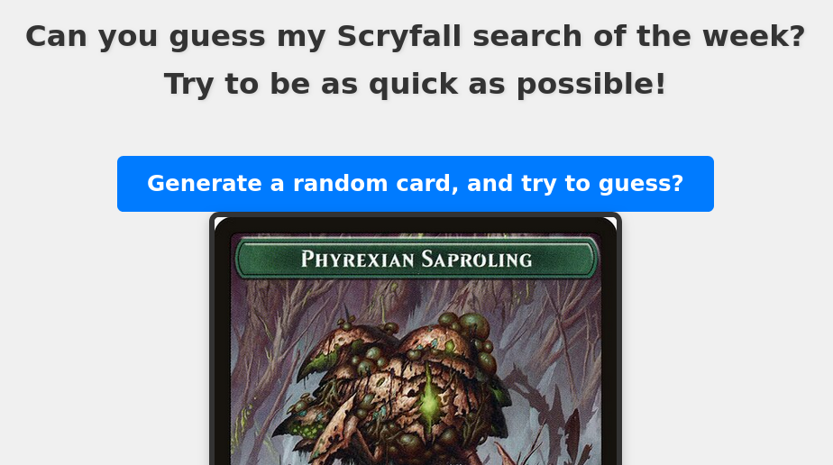

# [Can you guess my Scryfall search of the week? Try to be as quick as possible!](https://naereen.github.io/Can-you-guess-my-Scryfall-search-of-the-week-MTG/)

This is a tiny web game for Magic: The Gathering fans, powered by the [Scryfall API](https://scryfall.com/docs/api).
Play alone, or challenge your friends!

### How to play?

- Click the *"Generate a random card"* button to reveal a random Magic card matching a secret Scryfall search.
- Try to guess the search criteria based on the cards you see.
- You can switch between English and French using the language toggle at the bottom.
- When you're ready, reveal the solution to see if you guessed correctly!

### ✨ Cool features!

- Random card generation from a *hidden* Scryfall search, updated every week (if I think about it).
- Bilingual interface with a button to swap languages (English 🇬🇧 and French 🇫🇷).
- Responsive and simple design.
- Not affiliated with Scryfall or Wizards of the Coast — just for fun!

Enjoy the challenge, and see how quickly you can deduce the weekly query I used!

---

## Link to try out the "game"

[Play the game here on GitHub](https://naereen.github.io/Can-you-guess-my-Scryfall-search-of-the-week-MTG/)

([Or here on my personal website](https://perso.crans.org/besson/publis/Can-you-guess-my-Scryfall-search-of-the-week-MTG/))

## Screenshot of the "game"

---

## :scroll: License ? 
[MIT License](https://lbesson.mit-license.org/) (file [LICENSE](LICENSE)).
© [Lilian Besson](https://GitHub.com/Naereen), 2025.

